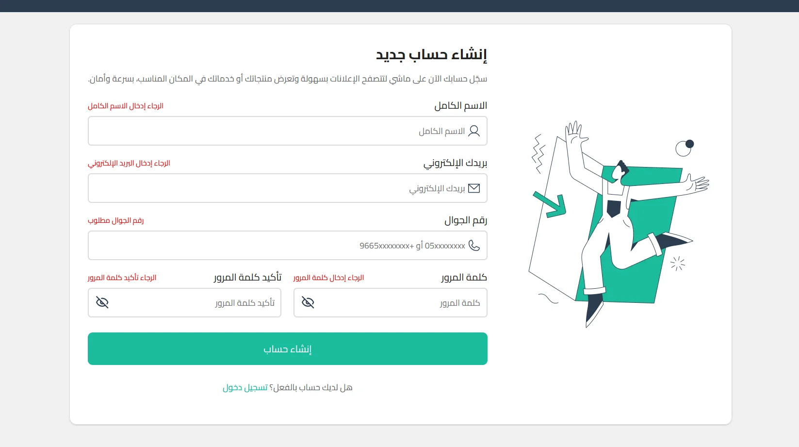
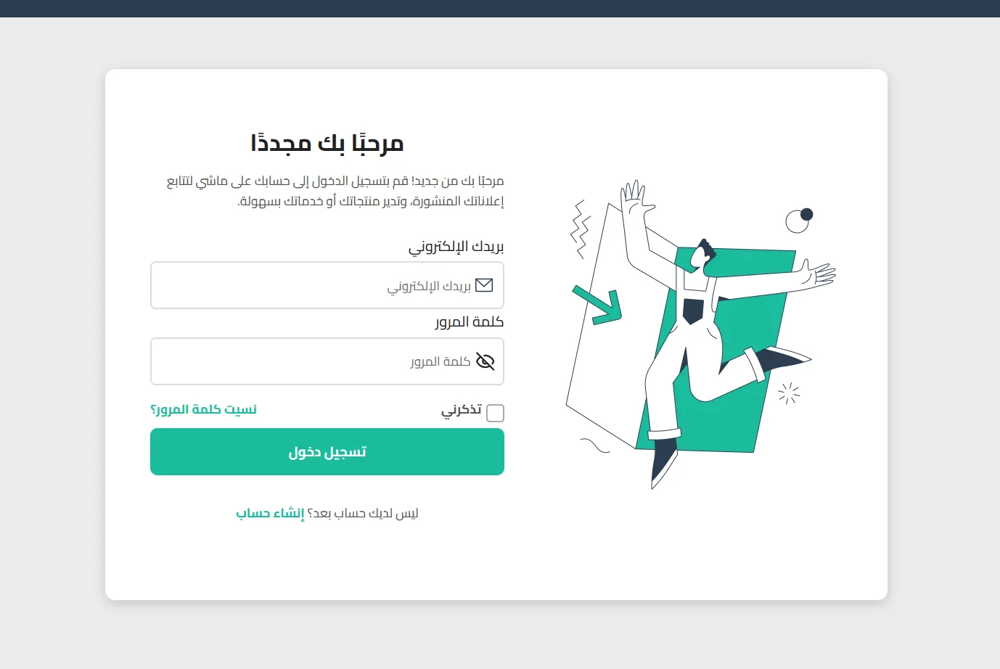

# React + Vite

# 🛍️ Maaashi | Classified Ads Platform

**Maaashi** is a web application inspired by the Saudi platform _Haraj_, where users can post and browse advertisements for products or services in an easy and organized way.

---

## 🚀 Features

- 🔐 **Authentication System**  
   Users can register, log in, and manage their accounts securely.

- **📸 Preview**

<div align="center" style="display: flex; flex-wrap: wrap; justify-content: center; gap: 15px;">






</div>

- 📝 **Post Advertisements**  
  After creating an account, users can add their own ads with product details and images.

- 🗂️ **Category-Based Browsing**  
  Users can browse and filter ads based on specific categories (e.g., Cars, Electronics, Real Estate, etc.).

- 👀 **View Ad Details**  
  Each ad includes full information such as title, price, location, and seller info.

- 📱 **Responsive UI**  
  The website is fully responsive and works seamlessly across all devices.

- ⚡ **Smooth User Experience**  
  Built with reusable components and clean UI interactions.

---

## 🧠 Tech Stack

| Area             | Technology          |
| ---------------- | ------------------- |
| Front-End        | React.js + Vite     |
| Styling          | CSS                 |
| State Management | Context API         |
| Routing          | React Router        |
| Notifications    | Custom Toast System |
| Hosting          | Vercel              |

---

## 📂 Project Structure

Maaashi/
├── src/
│ ├── Components/
│ ├── Pages/
│ ├── Context/
│ ├── Assets/
│ └── App.jsx
├── public/
└── package.json

---

## 💡 How It Works

1. User registers or logs in.
2. After authentication, they can add new ads through a multi-step **Wizard Form**.
3. Each ad is categorized (e.g., Cars, Phones, Furniture).
4. Users can filter and browse ads by category.
5. Users can view detailed information about any ad, including seller info and location.

---

## 🧰 Installation & Setup

```bash
# Clone the repository
git clone https://github.com/your-username/maaashi.git

# Navigate to project folder
cd maaashi

# Install dependencies
npm install

# Start the development server
npm run dev
```